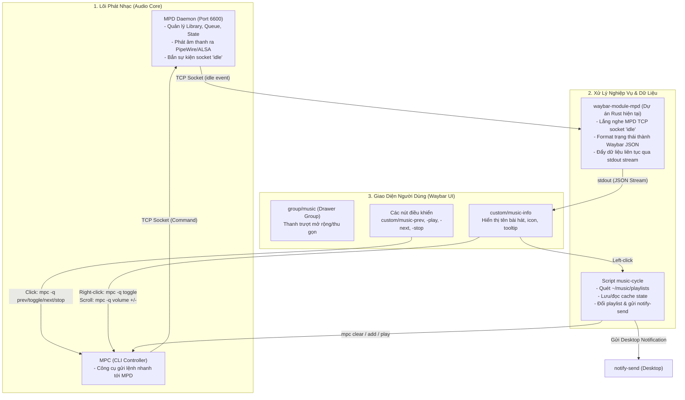

# Tài Liệu Kiến Trúc & Luồng Tương Tác Hệ Thống Âm Nhạc Waybar

Tài liệu này giải thích chi tiết vai trò của từng thành phần và cách chúng phối hợp, tương tác với nhau trong hệ sinh thái quản lý âm nhạc của Waybar.

---

## 1. Tổng Quan Kiến Trúc & Sơ Đồ Tương Tác

Hệ thống hoạt động theo mô hình **hướng sự kiện (event-driven)** kết hợp **luồng stream liên tục (continuous streaming)** và **điều khiển bất đồng bộ (CLI triggers)**.



---

## 2. Chi Tiết Vai Trò Từng Bộ Phận

### A. MPD (Music Player Daemon) & MPC
- **Vai trò:**
  - **MPD (`mpd`)**: Là dịch vụ nền chạy độc lập, đóng vai trò máy chủ phát nhạc và quản lý toàn bộ thư viện bài hát (`~/music`), hàng đợi (queue), trạng thái phát (Play, Pause, Stop), thời lượng và mức âm lượng.
  - **Cơ chế Socket (`idle`)**: MPD duy trì giao thức TCP trên cổng `6600`. Khi trạng thái máy nghe nhạc thay đổi (chuyển bài, thay đổi âm lượng, dừng/phát), MPD sẽ thông báo tức thì tới các client đang lắng nghe lệnh `idle` mà không đòi hỏi client phải liên tục gửi truy vấn (polling).
  - **MPC (`mpc`)**: Công cụ dòng lệnh chính thức giao tiếp với MPD qua socket để thực thi các tác vụ tức thời (`mpc toggle`, `mpc next`, `mpc prev`, `mpc volume`, `mpc clear`, `mpc add`...) mà không cần giữ kết nối lâu dài.

---

### B. Dự án hiện tại (`music_rs` / `waybar-module-mpd`)
- **Vị trí nhị phân:** Được biên dịch và triển khai tại `/home/nvlan/.config/waybar/scripts/music`.
- **Vai trò:**
  - Là **cầu nối trạng thái thời gian thực (Real-time Status Bridge)** giữa MPD và Waybar.
  - **Giao tiếp với MPD:**
    1. Kết nối TCP socket tới `127.0.0.1:6600`.
    2. Gửi lệnh `idle player mixer options` để chặn (block) luồng và chuyển về trạng thái ngủ (`0% CPU`).
    3. Khi MPD phát sinh sự kiện, module thức dậy, gửi bó lệnh nguyên tử `command_list_begin` -> `status` + `currentsong` -> `command_list_end` để lấy toàn bộ thông tin mới nhất.
  - **Giao tiếp với Waybar:**
    1. Chuyển đổi dữ liệu MPD thành cấu trúc JSON hợp lệ cho Waybar (`text`, `tooltip`, `class`, `alt`).
    2. Định dạng chuỗi hiển thị theo mẫu (hỗ trợ `%title%`, `%artist%`, `%album%`, `%duration%`, `%volume%`, icon FontAwesome).
    3. Xử lý cắt ngắn chuỗi linh hoạt (`--title-width`, `--ellipsis`, `--max-length`) để không làm vỡ bố cục thanh taskbar.
    4. Gán CSS class tương ứng (`playing`, `paused`, `stopped`) cho Waybar style.
    5. Đẩy dữ liệu ra `stdout` và `flush` ngay lập tức để cấp luồng stream liên tục cho Waybar.

---

### C. Module Music trong Waybar (`config.jsonc`)
- **Vị trí:** Cấu hình trong `~/.config/waybar/config.jsonc`.
- **Vai trò:**
  - Cung cấp **giao diện tương tác người dùng (UI & Action Controller)** trên thanh bar.
  - **Nhóm hiển thị `group/music`**:
    - Sử dụng kiểu `drawer` với hiệu ứng trượt mượt mà (`transition-duration: 400`).
    - Mặc định chỉ hiển thị tên bài (`custom/music-info`). Khi hover hoặc kích hoạt, drawer mở ra hiển thị các nút điều khiển.
  - **`custom/music-info`**:
    - Chạy tiến trình nền `waybar-module-mpd` qua `"exec": "/home/nvlan/.config/waybar/scripts/music ..."` ở chế độ stream (`"return-type": "json"`).
    - Đón nhận tương tác chuột:
      - **Chuột trái (`on-click`)**: Kích hoạt script `music-cycle` (chuyển playlist).
      - **Chuột phải (`on-click-right`)**: `mpc -q toggle` (Phát / Tạm dừng).
      - **Cuộn chuột lên / xuống (`on-scroll-up` / `on-scroll-down`)**: Tăng/giảm âm lượng MPD (`mpc -q volume +/-1`).
  - **Các nút điều khiển (`custom/music-prev`, `-play`, `-next`, `-stop`)**:
    - Cung cấp các nút icon trực quan (``, ``, ``, ``).
    - Khi người dùng click, Waybar gọi trực tiếp các lệnh `mpc` tương ứng.

---

### D. Script `music-cycle` (`/home/nvlan/.config/waybar/scripts/music-cycle`)
- **Vai trò:**
  - Là **trình luân chuyển danh sách phát thông minh (Playlist Switcher)** cho MPD.
  - **Quản lý danh sách:** Quét thư mục `~/music/playlists` để lấy tất cả các thư mục playlist con hiện có.
  - **Quản lý trạng thái:** Sử dụng tệp `~/.cache/waybar-mpd-playlist.state` để ghi nhớ playlist nào đang phát.
  - **Logic hoạt động khi được gọi (bởi cú click chuột trái vào Waybar):**
    1. Đọc tên playlist đã lưu trước đó.
    2. Xác định chỉ mục tiếp theo theo vòng lặp tròn: `index = (current_index + 1) % total_playlists`.
    3. Cập nhật tên playlist mới vào `~/.cache/waybar-mpd-playlist.state`.
    4. Xóa hàng đợi MPD hiện tại (`mpc clear`).
    5. Nạp toàn bộ nhạc từ playlist mới (`mpc add "<tên_playlist>"`).
    6. Bắt đầu phát bài đầu tiên (`mpc play`).
    7. Đếm số lượng bài hát và gửi thông báo màn hình desktop qua `notify-send`.

---

## 3. Các Luồng Hoạt Động Cụ Thể (Workflow Scenarios)

### Kịch bản 1: Luồng hiển thị thông tin bài hát (Hiển thị thời gian thực)
1. MPD chuyển sang bài hát mới hoặc người dùng bấm phát nhạc.
2. MPD phát tín hiệu `player` qua socket kết nối `idle`.
3. `waybar-module-mpd` nhận tín hiệu, ngay lập tức gửi lệnh lấy `status` và `currentsong`.
4. `waybar-module-mpd` format kết quả thành JSON (vd: `{"text": " Tên bài hát", "tooltip": "...", "class": "playing"}`).
5. Dòng JSON được in ra `stdout` và flush.
6. Waybar đọc dòng mới từ `stdout` và cập nhật tức thời text, tooltip cùng class CSS tương ứng trên thanh bar.

---

### Kịch bản 2: Luồng tương tác điều khiển (Play / Pause / Next / Prev / Volume)
1. Người dùng cuộn chuột trên module `custom/music-info` hoặc click nút `custom/music-next`.
2. Waybar nhận sự kiện và thực thi lệnh shell được cấu hình (ví dụ: `mpc -q next` hoặc `mpc -q volume +1`).
3. Lệnh `mpc` gửi chỉ thị qua socket TCP tới MPD.
4. MPD cập nhật âm lượng hoặc nhảy bài.
5. Ngay khi MPD thay đổi, sự kiện `idle` kích hoạt lại **Kịch bản 1** để cập nhật UI.

---

### Kịch bản 3: Luồng chuyển đổi Playlist (Playlist Cycling)
1. Người dùng click chuột trái vào `custom/music-info`.
2. Waybar khởi chạy `/home/nvlan/.config/waybar/scripts/music-cycle`.
3. `music-cycle` đọc danh sách playlist trong `~/music/playlists`, chọn playlist kế tiếp, lưu state và gửi chuỗi lệnh:
   ```bash
   mpc clear
   mpc add "<Playlist_Mới>"
   mpc play
   ```
4. `music-cycle` gọi `notify-send` để thông báo cho người dùng popup hệ thống.
5. MPD nhận bài hát mới và bắt đầu phát -> kích hoạt sự kiện `idle` -> `waybar-module-mpd` cập nhật bài hát mới lên Waybar.

---

### Kịch bản 4: Tích hợp với Menu Nguồn (Power Management)
Trong `config.jsonc` (module `custom/power`):
- Khi người dùng chọn **Logout**, **Suspend**, **Reboot**, hoặc **Shutdown**, hệ thống luôn thực thi lệnh `mpc -q pause` trước khi gọi lệnh hệ thống (`systemctl suspend`, `systemctl reboot`, v.v.).
- Điều này đảm bảo nhạc luôn được tạm dừng sạch sẽ trước khi hệ thống chuyển trạng thái.

---

## 4. Bảng Tổng Hợp So Sánh Trách Nhiệm

| Thành phần | Loại | Đầu vào (Input) | Đầu ra (Output) | Giao thức / Cơ chế |
| :--- | :--- | :--- | :--- | :--- |
| **MPD** | Background Daemon | Lệnh điều khiển TCP | Audio stream, Socket Events | TCP Socket (Port 6600) |
| **MPC** | CLI Client | Đối số dòng lệnh (CLI args) | Lệnh điều khiển MPD | TCP Socket một lần |
| **`music_rs`** *(module)* | Rust Monitor Daemon | MPD Socket Events (`idle`) | JSON stream ra `stdout` | TCP Socket + Stdout Stream |
| **`config.jsonc`** *(Waybar)* | Status Bar UI | Stdout Stream từ `music_rs`, User Clicks/Scrolls | Hiển thị giao diện, chạy lệnh shell | GTK Wayland Bar |
| **`music-cycle`** | Bash Script | Sự kiện click chuột trái từ Waybar | Lệnh `mpc` + Desktop Notification | File I/O + CLI calls |
